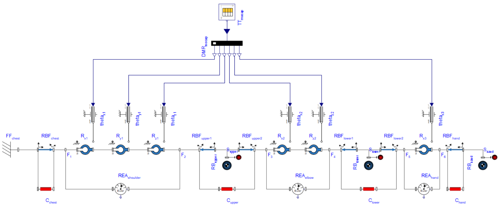
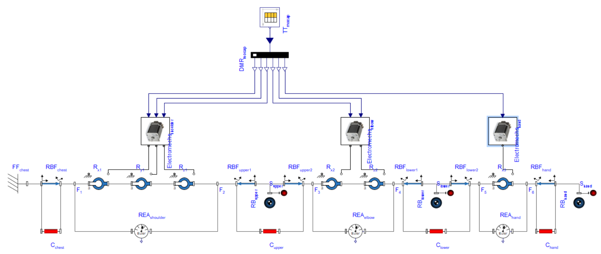
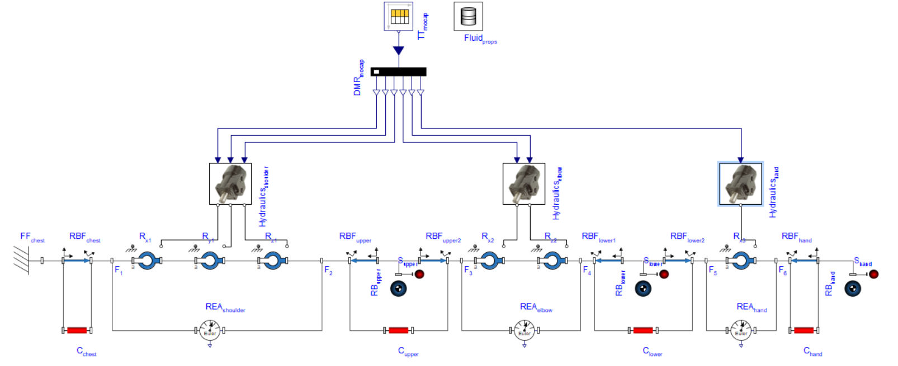
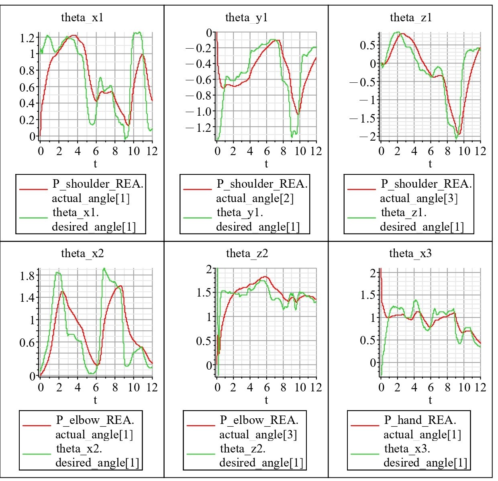
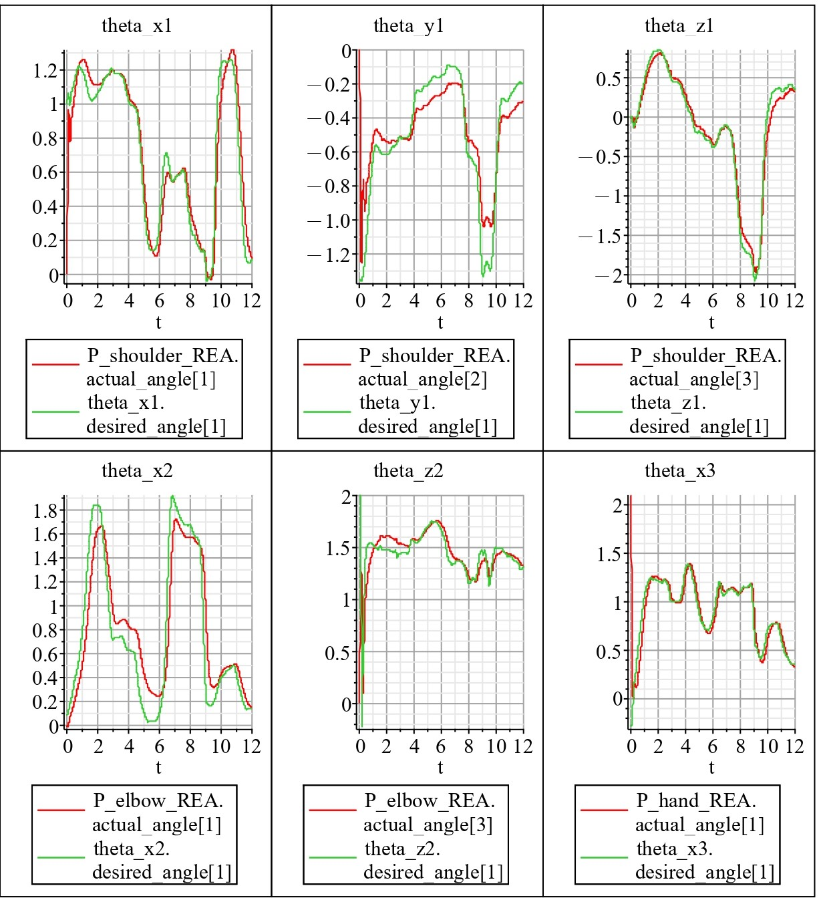
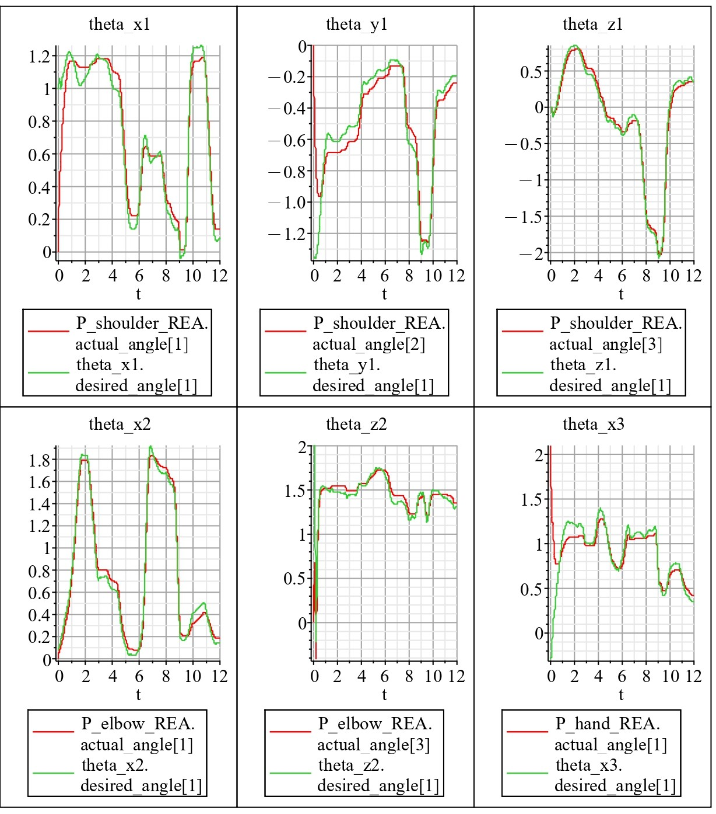

# Mechatronics Systems - Human Robotic Arm

## Table of Contents
1. [Project Overview](#1-project-overview)
2. [Development Tools](#2-development-tools)
3. [Authors](#3-authors)

## 1. Project Overview

This project was developed for submission in **Modelling and Simulation of Mechatronic Systems** course at **[University of Trento](https://www.unitn.it/en)**.

The main goal was to study and design a robotic arm capable of replicating human arm motion and performing load lifting tasks, prioritizing energy efficiency and lightweight design.

To achieve this, three example datasets generated by a motion capture system were provided alongside a Maple file that allowed to process the raw datasets and generate realistic humanoid arm movement that served as a reference.

### 1.1 Structure

The overall structure of the project can be divided into three consecutive critical parts:
1. System Description
2. System Modelling
3. System Analysis

### 1.2 System Description

To efficiently describe the system, engineering specifications and customer requirements must be introduced. These specifications should be independent from each other, representing kinematic and dynamic requirements. Ensuring the accuracy of the robotic arm's motion with respect to human motion, while maintaining energy efficiency, lightweight design, and comfort for everyday use:

| ENGINEERING SPECIFICATIONS | CUSTOMER REQUIREMENTS           |
|----------------------------|---------------------------------|
| Degrees of Freedom (DOF)   | Compliance with Human Arm       |
| Reach                      | Lightweight Design              |
| Max Payload                | Modularity                      |
| Angular Velocity           | Accuracy of Object Positioning  |
| Weight                     | Range of Motion                 |
| Error in Positioning       | End-effector Gripping Force     |
| Gripping Force             | Payload Capacity                |
| Protection Rating          | Energy Efficiency               |
| Expected Lifespan          | Thermal Resistance              |
| Thermal Coefficient        | Cost                            |
| Power Rating               | Comfort                         |
| Backup                     | Durability                      |
| Noise Level                | Safety                          |
| Impact Force               | Appearance                      |

### 1.3 System Modelling

The provided datasets and kinematics define the geometry, featuring a degree of freedom of 6:

- **Bodies**
    - Chest to shoulder
    - Shoulder to elbow
    - Elbow to wrist
    - Wrist to hand

- **Joints**
    - 3 revolute joints for the shoulder on X, Y, Z
    - 2 revolute joints for the elbow on X, Z
    - 1 revolute joint for the wrist on X (Y-axis rotation is omitted due to missing marker)

Successfully assembling a reference model served as a starting point for two different approaches for realistic implementation:
1. **Electromechanical solution** (with servo motors)
2. **Hydraulic solution** (with hydraulic motors)

#### 1.3.1 Reference Model

The raw data coming from the motion capture system was transformed from 3D coordinates to joint angles that was fed into the reference model:

#### 1.3.2 Solution 1 - Electromechanical Model: Servo Motors

The incorporated electromechanical subsystems (one for each joint, 6 in total) consist of servo motors powered by DC permanent magnets and are controlled by a PID controller.

#### 1.3.3 Solution 2 - Hydraulic Model: Hydraulic Motors

The utilized hydraulic subsystems (one for each joint, 6 in total) operate with hydraulic motors connected to two tanks via a 4-way valve (DCV 43 close) and are controlled by a PID controller. 

### 1.4 System Analysis

The final step involves optimizing and analyzing the most suitable model. Therefore, PID fine-tuning was applied to the electromechanical model, as the hydraulic model met requirements sufficiently.

#### 1.4.1 Electromechanical (untuned) - Actual vs. Reference Angles

#### 1.4.2 Electromechanical (tuned) - Actual vs. Reference Angles

#### 1.4.3 Hydraulic (untuned) - Actual vs. Reference Angles

#### 1.4.4 Chosen Model

The chosen electromechanical model, while initially less accurate than the hydraulic counterpart without PID fine-tuning, offers easier motor installation. After PID fine-tuning, it achieves greater precision and faster response times.

### 1.5 Conclusion

In summary, two distinct models were designed to simulate human arm movement: electromechanical and hydraulic. While the hydraulic model excels in accuracy, the fine-tuned electromechanical model also offers remarkable precision, satisfying the project's assumptions regarding the lightweight design and energy efficiency.

## 2. Development Tools

**Software Tools**:
- **[Maple](https://www.maplesoft.com/products/Maple/)**: A powerful mathematical computation software.
- **[MapleSim](https://www.maplesoft.com/products/maplesim/)**: A multi-domain physical modeling and simulation software.

## 3. Authors
- Irtaza Muhammad
- Ferenc Szendrei

[Back to Top](#mechatronics-systems---human-robotic-arm)
